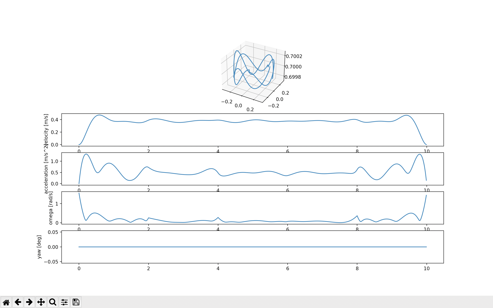

# crazypaths

Modules that enable path planning with the Bitcraze Crazyflie2.X with motion capture systems integrated in the control loop.

## What is this?

This repository is largely a derivative of the scripts contained within [whoenig/uav_trajectories](https://github.com/whoenig/uav_trajectories) and [crazyflie-lib-python/qualisys_hl_commander.py](https://github.com/bitcraze/crazyflie-lib-python/blob/master/examples/qualisys/qualisys_hl_commander.py). I have made minor changes from these scripts in order to streamline the process for global path planning with Crazyflie and Qualisys motion capture in the high-level loop. The main contribution in this repo is that `qualisys_hl_commander.py` will import directly from the polynomial CSV file and that it can be run through the command line. 

## Setup

I developed and tested these on Ubuntu 20.04 with Python 3.8 and macOS Monterey with Python 3.10. 

### Dependencies

```bash
$ sudo pip3 install scipy matplotlib pandas numpy cfclient
```

## Usage

Clone the Git repository. To do so, navigate into a directory of your choice and run:

```bash
git clone https://github.com/shreeram-murali/crazypaths.git
```

Then, `cd` into `crazypaths`. Make a time-varying waypoint .csv file `t, x, y, z` in the `/paths/` directory. 

For example, this is an example in the format "interpreter program input output":

```bash
python3 trajectory_scripts/generate_trajectory.py /paths/circle_waypoints.csv paths/circle_polynomial_2.csv
```

To see the plot of the path, run:

```bash
python3 trajectory_scripts/plot_trajectory.py /paths/circle_polynomial_2.csv
```

To have the Crazyflie execute this path (if you have Qualisys -- more on that below), run:

```bash
python3 cf_commander/qualisys_hl_commander.py paths/circle_polynomial_2.csv cf1 192.168.0.106
```

The above command follows the format "python3 program polynomial-file rigid-body-name QTM-IP"

(*Tip: Please use tab-autocomplete feature instead of copy pasting these commands.*)

## Qualisys

In order for this to work properly, one must:

1. Open QTM (Qualisys Track Manager) to the "Markers" page

2. Connect to WiFi 

3. Make sure 6DOF tracking is enabled in *project options*

## Example

```bash
python3 trajectory_scripts/generate_trajectory.py paths/circle_waypoints.csv paths/circle_polynomial_2.csv

0.0003152763976201386
0.011047588610698116
1.6705698923561263e-06
```

```bash
python3 trajectory_scripts/plot_trajectory.py paths/circle_polynomial_2.csv 

max speed (m/s):  0.47347308702566904
max acceleration (m/s^2):  1.3208665682570173
max omega (rad/s):  1.5487862531350483
max roll (deg):  7.029917967616536
max pitch (deg):  3.094890561377085
```

Screenshot of the plot:



## References

C. Richter, A. Bry, and N. Roy, “**Polynomial trajectory planning for aggressive quadrotor flight in dense indoor environments,**” in *International Journal of Robotics Research*, Springer, 2016.
